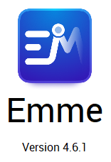

# Travel Model 2 Python Package

A python package to run the San Francisco Bay Area's Travel Model.

**Owner:** Metropolitan Transportation Commission (MTC)

[](https://github.com/BayAreaMetro/tm2py/actions/workflows/test.yml)

[](https://github.com/BayAreaMetro/tm2py/actions/workflows/docs.yml)

[](https://github.com/BayAreaMetro/tm2py/actions/workflows/publish.yml)

## Installation

Recommended install in a virtual environment.

Stable (to come - use bleeding edge for now):

```bash
pip install tm2py
```

Bleeding edge:
TODO: Which environment is this?  Does it still work for anyone?

```bash
conda env create -f environment.yml
conda activate tm2py
pip install git+https://github.com/bayareametro/tm2py@develop
```

The above directions didn't work for the MTC Windows environment.  The following method did work, on a machine with Emme-4.6.0 installed.  This required a compiled GDAL/Fiona package set for python 3.7, this can be found in the [lib directory](/lib/) , consisting of the following:

1. GDAL-3.3.2-cp37-cp37m-win_amd64.whl
2. pyproj-3.2.1-cp37-cp37m-win_amd64.whl
3. Fiona-1.8.20-cp37-cp37m-win_amd64.whl
4. Shapely-1.8.1-cp37-cp37m-win_amd64.whl
5. geopandas-0.10.2-py2.py3-none-any.whl

With these files in hand, the following installation instructions work:

```bat
conda create -n tm2py python=3.7.6
conda activate tm2py
pip install [the packages listed above, in that order]
cd <path to tm2py git directory>
pip install -e .
conda env config vars set GDAL_VERSION=3.3.2
```
Finally, install the Emme python packages using the Emme GUI. This effectively creates a file,
`C:\Users\%USERNAME%\.conda\envs\tm2py\Lib\site-packages\emme.pth` with the following contents, so you could create the file yourself.

```python
import os, site; site.addsitedir("C:/Program Files/INRO/Emme/Emme 4/Emme-4.6.0/Python37/Lib/site-packages")
```

In troubleshooting, sometimes DLL load failure errors would occur which may be resolved by importing gdal before importing emme packages. Emme support explained this thusly:

At load time, the EMME API will always load the geos_c co-located with the EMME API, unless it was already loaded from some other location, which is the case when you import GDAL first. EMME API seems to be compatible with the newer GDAL/geos_c (reminder: not tested!). But this does not appear to be the case the other way around (newer GDAL is not compatible with older geos_c).

Copy and unzip [example_union_test_highway.zip](https://mtcdrive.box.com/s/3entr016e9teq2wt46x1os3fjqylfoge) to a local
drive and from within that directory run:

```sh
get_test_data <location>
tm2py -s scenario.toml -m model.toml
```

See [starting out](http://bayareametro.github.com/tm2py) section of documentation for more details.

### Example Data

This respository doesn't come with example data due to its size. However, it does provide helper functions to access it from an online bucket:

```bash
get_test_data location/for/test/data
```

Alternatively, you can access it from [example_union_test_highway.zip](https://mtcdrive.box.com/s/3entr016e9teq2wt46x1os3fjqylfoge)

See [starting out](http://bayareametro.github.com/tm2py) section of documentation for more details.

### Usage

#### Python

```python
import tm2py
controller = RunController(
    ["scenario_config.toml", "model_config.toml"],
    run_dir="UnionCity",
)
controller.run()
```

- `run_dir` specifies specific run directory. Otherwise will use location of first `config.toml` file.

#### Terminal

```sh
<path to tm2py>\bin\tm2py -s examples\scenario_config.toml -m examples\model.toml [-r <location>]
```

- `-s scenario.toml` file location with scenario-specific parameters
- `-m model.toml` file location with general model parameters
- `-r run_dir` specifies specific run directory. Otherwise will use location of first `config.toml` file.

Additional functionality for various use cases can be found in [Examples](examples).

### Common Issues
If the above instructions are installed and the model fails, there are some common issues depending in the computer being installed 

#### Running With Multiple Emme Versions Installed
This model has compatibility with emme version 4.6.1 (as of the TM2.2.1.1 release). If multiple versions of emme are installed, the above install instructions will launch the latest version of emme, regardless of which directory the emme.pth file was copied from. The correct emme version (4.6.1) can be launched using the following steps:
1) Open emme.pth file in the notepad and replace the os.environ["EMMEPATH"] with the path to the emme version you would like, in this case 4.6.1
```python
import os, site; site.addsitedir(os.path.join(r"C:\\Program Files\\INRO\\Emme\\Emme 4\\Emme-4.6.1", "Python37/Lib/site-packages"))
```
2) At the beginning of first python file run_model.py add this line
```python
os.environ["EMMEPATH"] = "C:\\Program Files\\INRO\\Emme\\Emme 4\\Emme-4.6.1"
```
When running the model verify that the correct version eof emme is opened.





## Contributing

Details about contributing can be found on our documentation website: [](https://bayareametro.github.io/tm2py/contributing)
