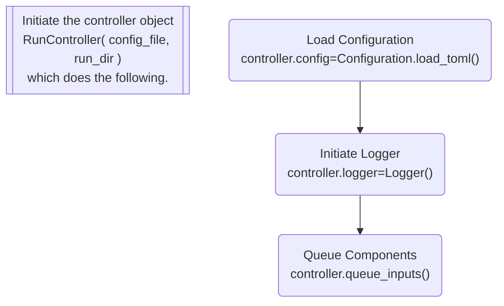
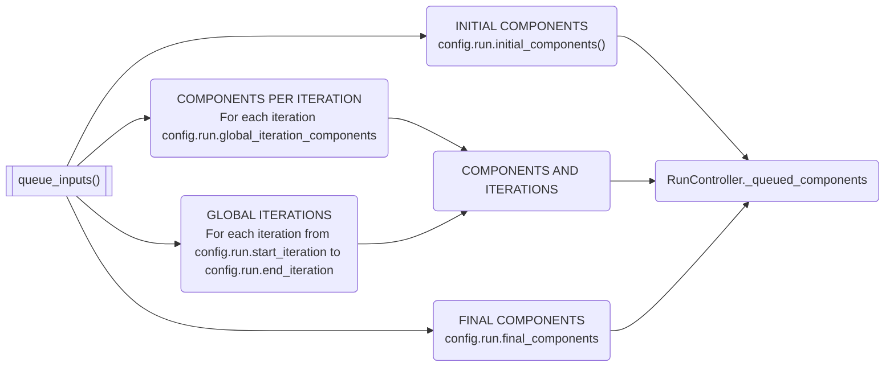
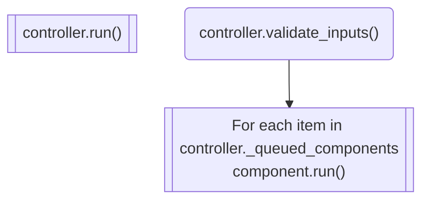

### For testing feature

The purpose

## Starting Out

!!! Tip

    The `tm2py` library works on top of [Inro's Emme Software](https://www.inrosoftware.com/en/products/emme/).  (Almost) all of the functionality of this library requires a valid Emme installation and license.

Note that you'll also need to install Emme's python packages into this conda environment.
Following these instructions from an INRO community forum post: In the Emme Desktop application, open Tools->Application Options->Modeller, change your Python path as desired and click the "Install Modeller Package" button.
Alternatively, you can copy the emme.pth from the Emme install to the site packages. This looks like:

```bash
cd tm2py
REM ... or from the root of the venv / conda environment
copy %EMMEPATH%\emme.pth Lib\site-packages\
```

If this is successful, the following packages will be visible in your environment when you type `pip list`:

* inro-dynameq
* inro-emme
* inro-emme-agent
* inro-emme-engine
* inro-modeller

Note that doing the emme package install will also install the package *pywin32*; if *pywin32* gets installed by other means (like
conda or pip), then I got DLL load errors when trying to import the emme packages, so I recommend uninstalling *pywin32* before
installing the emme packages.


### Installation

If you are managing multiple python versions, we suggest using [`virtualenv`](https://virtualenv.pypa.io/en/latest/) or [`conda`](https://conda.io/en/latest/) virtual environments.

The following instructions create and activate a conda environment (recommended) in which you can install:

```sh
conda env create -f environment.yml
conda activate tm2py
```

=== "Basic Install"

    ```bash
    pip install tm2py
    ```

=== "Bleeding Edge"

    If you want to install a more up-to-date or development version, you can do so by installing it from the `develop` branch as follows:

    ```bash
    conda env create -f environment.yml
    conda activate tm2py
    pip install git+https://github.com/bayareametro/tm2py@develop
    ```
    !!! Notes

        If you wanted to install from a specific tag/version number or branch, replace `@develop` with `@<branchname>`  or `@tag`

=== "From clone"

    If you are going to be working on Lasso locally, you might want to clone it to your local machine and install it from the clone.  The -e will install it in [editable mode](https://pip.pypa.io/en/stable/reference/pip_install/?highlight=editable#editable-installs).

    ```bash
    conda env create -f environment.yml
    conda activate tm2py
    git clone https://github.com/bayareametro/tm2py
    cd tm2py
    pip install -e .
    ```

    !!! Notes

        The -e installs it in editable mode which captures changes in the repository as you switch branches.

!!! tip "Developer Tip"
    If you are going to be doing development, we recommend following the installations instructions in the [contributing](contributing.md/development.md) section.

### Example Data

!!! warning "Before you run the model"

    Due to size limitations, the bulk of the input data is not stored with the `tm2py` library, but can be accessed following the directions below.

| Example | Location        |
| ======= | ===================== |
| Union City | [example_union_test_highway.zip](https://mtcdrive.box.com/s/3entr016e9teq2wt46x1os3fjqylfoge) |

Additionally, `tm2py` has a helper function to download the data using the following syntax:

=== "python"

    ```python
    import tm2py
    tm2py.get_test_data("UnionCity")
    ```

=== "terminal"

    ```sh
    get_test_data location/for/test/data
    ```

### Typical Usage

The following is the typical usage to run the model.  Other than the run directory, all the parameters for the model run are specified in [ any number of ] `toml` files, as documented in the configuration  [documentation](api.md#configuration) and [example](examples/configuration.md).

=== "python"

    ```python
    import tm2py
    controller = RunController(
        ["scenario_config.toml", "model_config.toml"],
        run_dir="UnionCity",
    )
    controller.run()
    ```
    - `run_dir` specifies specific run directory. Otherwise will use location of first `config.toml` file.

=== "terminal"

    ```sh
    tm2py -s scenario.toml -m model.toml -r run_dir
    ```

    - `-s scenario.toml` file location with scenario-specific parameters
    - `-m model.toml` file location with general model parameters
    - `-r run_dir` specifies specific run directory. Otherwise will use location of first `config.toml` file.

Additional functionality for various use cases can be found in [Examples](examples).

## What happens when you run the model

Setup of model run reads the settings and queues the components for each iteration.

```python
my_controller = tm2py.RunController(config_files,run_dir)
```



`RunController.queue_inputs()`



Example model run configuraiton file with components in the order they are to be run:

```toml
[run]
    start_component = ""
    initial_components = [
        "create_tod_scenarios",
        "active_modes",
        "air_passenger",
        "prepare_network_highway",
        "highway",
        "highway_maz_skim",
        "prepare_network_transit",
        "transit_assign",
        "transit_skim"
    ]
    global_iteration_components = [
        "household",
        "internal_external",
        "truck",
        "highway_maz_assign",
        "highway",
        "prepare_network_transit",
        "transit_assign",
        "transit_skim"
    ]
    final_components = []
    start_iteration = 0
    end_iteration = 1

```

Running the model simply iterates through the queued components.

```python
my_run = my_controller.run()
```


