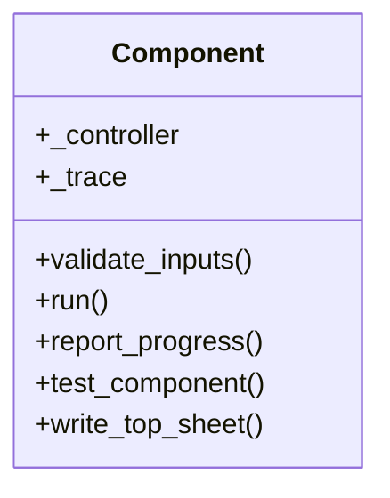
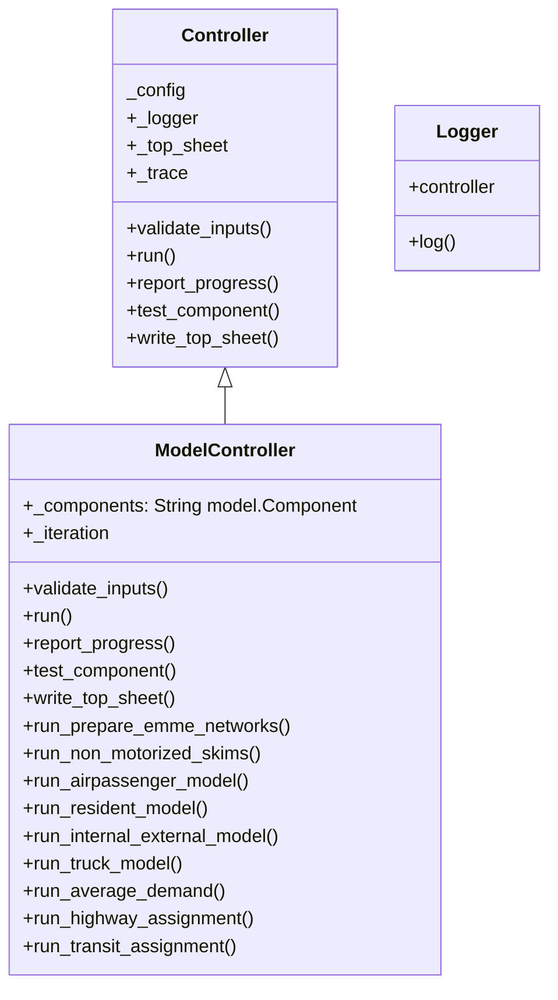
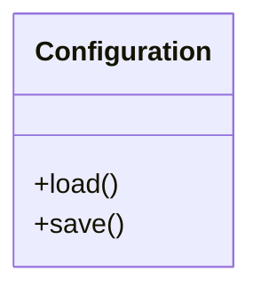
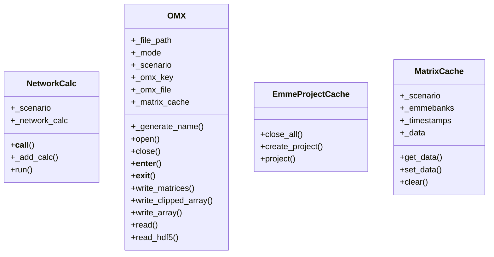
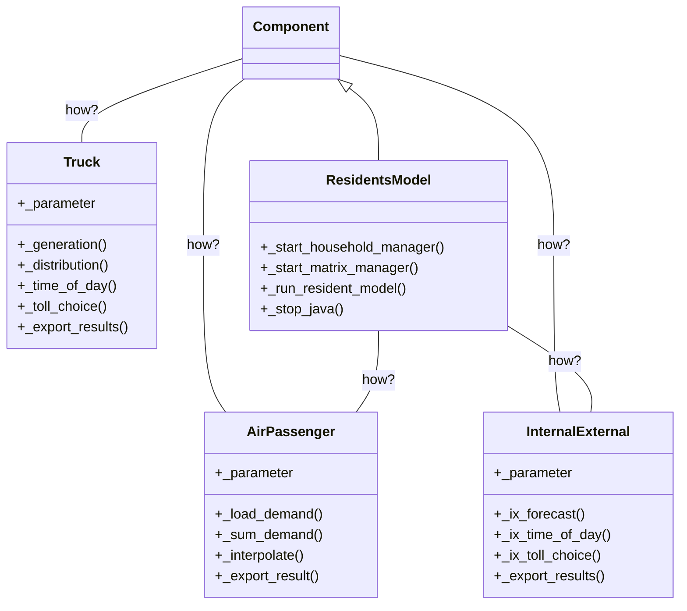
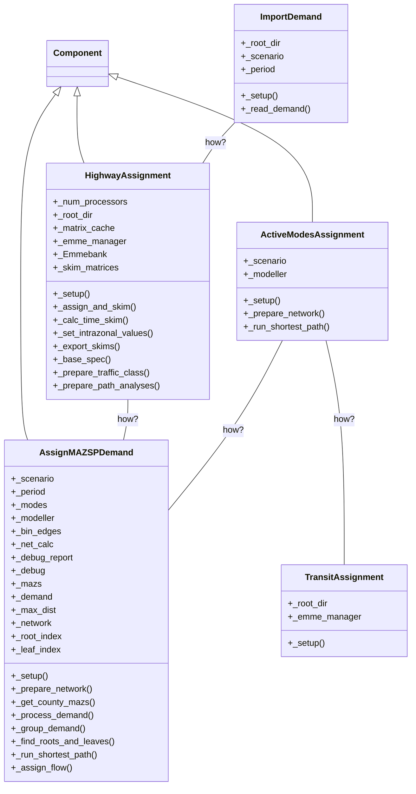

# Architecture

## Abstract Component

``` mermaid
classDiagram
    class Component{
        +_controller
        +_trace
        +validate_inputs()
        +run()
        +report_progress()
        +test_component()
        +write_top_sheet()
    }
```

## Controllers

``` mermaid
classDiagram
    Controller <|-- ModelController
    class Controller{
        _config
        +_logger
        +_top_sheet
        +_trace
        +validate_inputs()
        +run()
        +report_progress()
        +test_component()
        +write_top_sheet()
    }
    class ModelController{
        +_components: String model.Component
        +_iteration
        +validate_inputs()
        +run()
        +report_progress()
        +test_component()
        +write_top_sheet()
        +run_prepare_emme_networks()
        +run_non_motorized_skims()
        +run_airpassenger_model()
        +run_resident_model()
        +run_internal_external_model()
        +run_truck_model()
        +run_average_demand()
        +run_highway_assignment()
        +run_transit_assignment()
    }
    class Logger{
        +controller
        +log()
    }
```
## Configs

```mermaid
classDiagram
    class Configuration{
        +load()
        +save()
    }
```

## Utils

```mermaid
classDiagram
    class NetworkCalc{
        +_scenario
        +_network_calc
        +__call__()
        +_add_calc()
        +run()
    }
    class OMX{
        +_file_path
        +_mode
        +_scenario
        +_omx_key
        +_omx_file
        +_matrix_cache
        +_generate_name()
        +open()
        +close()
        +__enter__()
        +__exit__()
        +write_matrices()
        +write_clipped_array()
        +write_array()
        +read()
        +read_hdf5()
    }
    class EmmeProjectCache{
        +close_all()
        +create_project()
        +project()
    }
    class MatrixCache{
        +_scenario
        +_emmebanks
        +_timestamps
        +_data
        +get_data()
        +set_data()
        +clear()
    }

```
## Demand

``` mermaid

classDiagram
    Component -- AirPassenger: how?
    Component -- InternalExternal: how?
    Component -- Truck: how?
    Component <|-- ResidentsModel
    ResidentsModel -- InternalExternal: how?
    ResidentsModel -- AirPassenger: how?
    class Component{
    }
    class AirPassenger{
        +_parameter
        +_load_demand()
        +_sum_demand()
        +_interpolate()
        +_export_result()
    }
    class InternalExternal{
        +_parameter
        +_ix_forecast()
        +_ix_time_of_day()
        +_ix_toll_choice()
        +_export_results()
    }
    class ResidentsModel{
        +_start_household_manager()
        +_start_matrix_manager()
        +_run_resident_model()
        +_stop_java()
    }
    class Truck{
        +_parameter
        +_generation()
        +_distribution()
        +_time_of_day()
        +_toll_choice()
        +_export_results()
    }
```

## Assignment

``` mermaid

classDiagram
    Component <|-- HighwayAssignment
    Component <|-- AssignMAZSPDemand
    Component <|-- ActiveModesAssignment
    ActiveModesAssignment -- TransitAssignment: how?
    HighwayAssignment -- AssignMAZSPDemand: how?
    ImportDemand -- HighwayAssignment: how?
    ActiveModesAssignment -- AssignMAZSPDemand: how?
    class Component{
    }
    class HighwayAssignment{
        +_num_processors
        +_root_dir
        +_matrix_cache
        +_emme_manager
        +_Emmebank
        +_skim_matrices
        +_setup()
        +_assign_and_skim()
        +_calc_time_skim()
        +_set_intrazonal_values()
        +_export_skims()
        +_base_spec()
        +_prepare_traffic_class()
        +_prepare_path_analyses()
    }
    class ImportDemand{
        +_root_dir
        +_scenario
        +_period
        +_setup()
        +_read_demand()
    }
    class AssignMAZSPDemand{
        +_scenario
        +_period
        +_modes
        +_modeller
        +_bin_edges
        +_net_calc
        +_debug_report
        +_debug
        +_mazs
        +_demand
        +_max_dist
        +_network
        +_root_index
        +_leaf_index
        +_setup()
        +_prepare_network()
        +_get_county_mazs()
        +_process_demand()
        +_group_demand()
        +_find_roots_and_leaves()
        +_run_shortest_path()
        +_assign_flow()
    }
    class ActiveModesAssignment{
        +_scenario
        +_modeller
        +_setup()
        +_prepare_network()
        +_run_shortest_path()
    }
     class TransitAssignment{
        +_root_dir
        +_emme_manager
        +_setup()
    }
```
