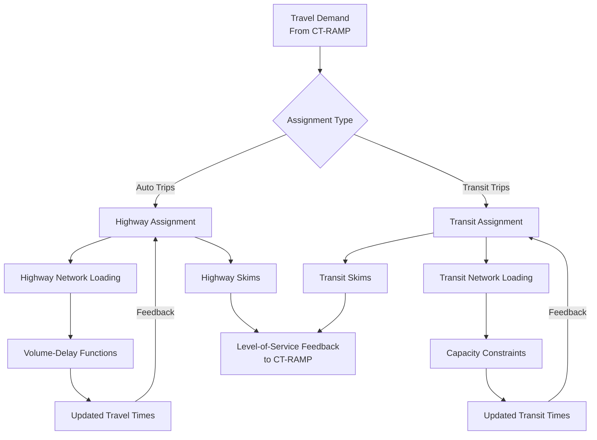

# Travel Model Two Assignment System

## Overview

The Travel Model Two (TM2) assignment system converts travel demand into traffic flows and transit ridership by simulating traveler route choice on transportation networks. The assignment system consists of two primary components: highway assignment and transit assignment, each using equilibrium-based algorithms to model realistic travel patterns.

## System Architecture



## Highway Assignment

### Highway Assignment Overview

The highway assignment component simulates vehicle route choice on the road network, accounting for congestion effects and traveler preferences for time, cost, and convenience.

### Highway Assignment Features

**Multi-Class Assignment**: Supports different vehicle types with distinct characteristics:

| Vehicle Class | Description | Network Access |
|---------------|-------------|----------------|
| Drive Alone (da) | Single-occupant vehicles | All facilities |
| Shared Ride 2 (sr2) | Two-person carpools | Includes HOV-2 lanes |
| Shared Ride 3+ (sr3) | Three+ person carpools | Includes HOV-3+ lanes |
| Very Small Trucks (vsm) | Light commercial vehicles | Most facilities |
| Small Trucks (sml) | Small commercial vehicles | Truck-restricted access |
| Medium Trucks (med) | Medium commercial vehicles | Truck-restricted access |
| Large Trucks (lrg) | Heavy commercial vehicles | Truck routes only |

**Equilibrium Algorithm**: Uses Emme's SOLA (Second Order Linear Approximation) algorithm for:

- **Traffic Assignment**: Route choice based on generalized cost minimization
- **Convergence**: Iterative process until stable flow patterns
- **Volume-Delay Functions**: Dynamic link travel times based on traffic volumes

### Network Representation

**Geographic Coverage**: 9-county San Francisco Bay Area
**Network Size**: ~180,000 directional links, ~85,000 nodes *(approximate - varies by model version)*
**Temporal Resolution**: Five time periods (AM peak, PM peak, midday, evening, early AM)

**Link Attributes**:

- **Capacity**: Maximum vehicle throughput
- **Free-Flow Speed**: Uncongested travel speed  
- **Volume-Delay Function**: Congestion relationship
- **Facility Type**: Freeway, arterial, local, ramp
- **Toll Information**: Bridge tolls, express lane tolls
- **Vehicle Restrictions**: HOV requirements, truck restrictions

### Generalized Cost

Highway assignment uses **value of time** to convert monetary costs to time-equivalent units:

**[Value of Time in Highway Assignment](highway_value_of_time.md)** - Detailed documentation of VOT parameters and implementation

**Components**:

- **Travel Time**: Link-specific travel times (minutes)
- **Distance Cost**: Operating cost × distance (cents/mile)
- **Toll Cost**: Bridge tolls, express lane tolls (cents)
- **Value of Time Conversion**: $18.93/hour (2010 dollars)

## Transit Assignment

### Transit Assignment Overview

The transit assignment component simulates passenger route choice on the public transportation network, including buses, rail, ferry, and multi-modal connections.

### Transit Assignment Features

**Capacity-Constrained Assignment**:

- **Initial Assignment**: Unconstrained shortest path assignment
- **Capacity Evaluation**: Check vehicle capacity limits
- **Crowding Effects**: Increased perceived travel time for overcrowded vehicles
- **Reassignment**: Iterative process with capacity constraints

**Multi-Modal Network**:

| Mode Type | Examples | Special Considerations |
|-----------|----------|----------------------|
| Bus | AC Transit, Muni Bus, VTA | Frequency-based headways |
| Rail | BART, Caltrain, VTA Light Rail | Schedule-based operations |
| Ferry | Golden Gate, SF Bay Ferry | Weather and capacity constraints |
| Cable Car | San Francisco Cable Car | Tourist vs. commuter usage |

### Access/Egress Modes

**Walk Access**: Direct walking to/from transit stops
**Drive Access**: Park-and-ride facilities
**Kiss-and-Ride**: Drop-off/pick-up access
**Bike Access**: Bicycle access to transit (bike parking/bike-on-board)

### Temporal Representation

**Service Periods**: Coordinated with highway time periods
**Headway-Based**: Frequent services represented by average wait times
**Schedule-Based**: Lower frequency services with specific departure times

## Level-of-Service Feedback

### Highway-Transit Integration

**Competitive Modes**: Highway congestion affects transit competitiveness
**Park-and-Ride**: Highway access costs influence transit ridership
**Cordon Pricing**: Area-based tolls affect mode choice

### CT-RAMP Integration

**Skim Generation**: Assignment produces level-of-service matrices
**Accessibility Measures**: Network performance influences activity location and mode choice
**Feedback Loops**: Multi-iteration process between demand and assignment

## Technical Implementation

### Software Platform

**Emme**: Primary assignment platform

- **Highway**: SOLA traffic assignment algorithm *(confirmed in code)*
- **Transit**: Strategy-based transit assignment *(uses OPTIMAL_STRATEGY)*
- **Integration**: Python API for TM2 coordination

**TM2 Python Framework**:

```python
tm2py/components/
├── network/
│   ├── highway/           # Highway assignment components
│   │   ├── highway_assign.py
│   │   ├── highway_maz.py  
│   │   └── highway_emme_spec.py
│   └── transit/           # Transit assignment components
│       ├── transit_assign.py
│       ├── transit_skims.py
│       └── transit_capacity.py
```

### Performance and Scalability

**Computational Requirements** *(estimated based on typical model performance)*:

- **Highway Assignment**: ~15-30 minutes per time period *(varies by network size and convergence criteria)*
- **Transit Assignment**: ~10-20 minutes per time period *(varies by service complexity and capacity constraints)*
- **Total Runtime**: 2-4 hours for complete assignment set *(including all time periods and iterations)*
- **Memory Usage**: 8-16 GB RAM recommended *(depends on network size and number of zones)*
- **Parallel Processing**: Multi-core CPU utilization *(configurable via emme.num_processors)*

## Validation and Calibration

### Highway Assignment Validation

**Traffic Counts**: Comparison with observed link volumes
**Travel Time Validation**: GPS-based travel time comparisons
**Toll Facility Usage**: Express lane and bridge crossing validation

### Transit Assignment Validation

**Ridership Counts**: Operator-provided boardings data
**Load Profiles**: Peak-direction, peak-period capacity utilization
**Transfer Patterns**: Multi-operator journey validation

## Configuration and Customization

### Assignment Parameters

**Convergence Criteria**: Gap functions and iteration limits
**Volume-Delay Functions**: Facility-specific congestion relationships  
**Value of Time**: Mode and income-specific time valuations
**Capacity Constraints**: Transit vehicle capacity and crowding effects

### Scenario Analysis

**Infrastructure Projects**: New facilities and capacity improvements
**Service Changes**: Transit service modifications
**Pricing Policies**: Tolling and fare policy evaluation
**Land Use Scenarios**: Development pattern impacts

## Related Documentation

### Technical Documentation

- **[Highway Value of Time](highway_value_of_time.md)** - VOT parameters and calculations
- **[Network Summary Component](../network_summary.md)** - Assignment result analysis
- **[Configuration Guide](../configuration.md)** - Assignment parameter setup

### Model Integration

- **[CT-RAMP Overview](../ctramp/index.md)** - Demand model integration
- **[Model Workflow](../run.md)** - Complete model execution process
- **[Outputs](../outputs.md)** - Assignment result interpretation

---

*Last Updated: November 2025*  
*Model Version: Travel Model Two v2.2*  
*Authors: MTC Staff & GitHub Copilot*
