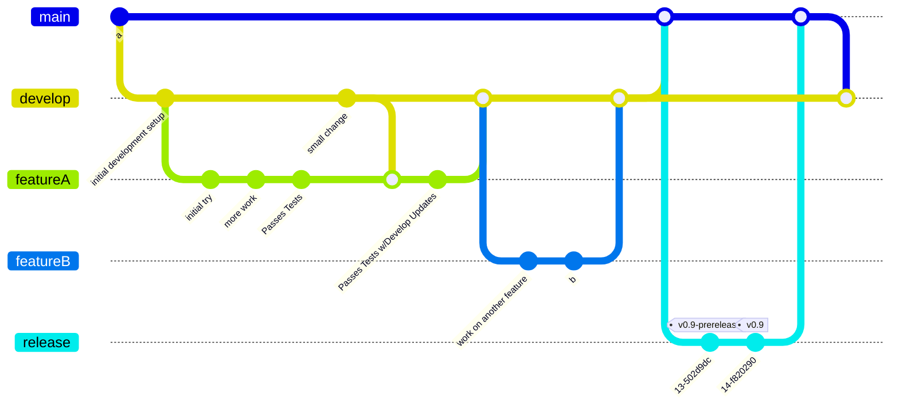

# Development

## Preparation

### Install Git

If you don't have it installed already, you will need to [install Git](https://git-scm.com/book/en/v2/Getting-Started-Installing-Git) version-contorl system.

=== "LINUX"

    ```sh
    sudo apt install git-all
    ```

=== "Mac"

    [](https://git-scm.com/download/mac)

    or

    ```sh
    brew install git
    ```

=== "Windows"

    [](https://git-scm.com/download/win)

!!! tip

    Also nstall [GitHub Desktop](https://desktop.github.com/) to make your life easier.

### Download `tm2py` Repository

Have a local clone of the entire `tm2py` repository on your machine:

=== "Terminal"

    ```sh
    git clone https://github.com/BayAreaMetro/tm2py.git
    ```

=== "GitHub Desktop"

    [Open Clone in GitHub Desktop](x-github-client://openRepo/https://github.com/BayAreaMetro/tm2py)

### Get a Text Editor

Text editors with python support and/or integrated development environments (IDEs) make development
a lot easier than working in notepad.  

Some to try:  

- [VS Code](https://code.visualstudio.com/)

## Development Pattern

Generally speaking, development uses git branches to manage progress on features and bugs while
maintaining a stable and versioned `main` branch while developing most features from the `develop`
branch as per the [git-flow model](https://nvie.com/posts/a-successful-git-branching-model/) and
product road-mapping as per [issues in milestones](https://github.com/BayAreaMetro/tm2py/milestones)
and managed in the [project board](https://github.com/BayAreaMetro/tm2py/projects).



## How to Contribute

**Issue Development:** Generally-speaking, all contributions should support an issue which has a
clearly-defined user-story, a set of tests/conditions which need to be demonstrated in order to
close the issue, an agreed-upon approach, and is assigned to the person who should be working on it.

**Branch:**
Use [GitHub's branching](https://docs.github.com/en/get-started/quickstart/github-flow) capabilities
to create a feature branch from the main `develop` branch which is clearly named (e.g. features:`feat-add-transit-assignment` bug fixes: `fix-crash-macosx`) and check it out.  

=== "Terminal"

    ```sh
    git checkout develop
    git checkout -b fix-maxos-crash
    ```

=== "GitHub Desktop"

    [Managing branches documentation(https://docs.github.com/en/desktop/contributing-and-collaborating-using-github-desktop/making-changes-in-a-branch/managing-branches)]

**Develop tests:** As much as possible, we use
[test-driven development](https://en.wikipedia.org/wiki/Test-driven_development) in order to clearly
define when the work is done and working.  This can be acheived through writing a new test or
extending another test.  **When this is complete, the specified test should fail.**

**Fix issue tests:** Complete development using the approach agreed upon in the issue.  **When this
is complete, the tests for the issue should pass.**

**Update/address other failing tests:** Update your branch with the most recent version of the develop
branch (which may have moved forward), resolving any merge-conflicts and other tests that may now
be failing. **When this is complete, all tests should pass.**

!!! tip

    You can (and should) push your changes throughout your work so that others can see what you
    are working on, contribute advice, and sometimes work on the issue with you.

**Update relevant documentation:** See the [Docmentation on Documentation](./documentation.md)

**Tidy your work:** In order to make sure all changes comply with our requirements and are consistent
with specifications (i.e. for markdown files, which aren't tested in `pytest`), we use
[`pre-commit`](https://pre-commit.com/):

```sh

pre-commit run --all-files

```

!!! tip

    Often pre-commit checks will "fail" on the first run when they are fixing the issues.  When
    you run it again, hopefully it will be successful.

**Pull-Request:** Create the pull-request which clearly defines what the pull request contains
and link it to the issues it addresses in the description via closing keywords (if applicable) or
references.  Finally, please assign reviewers who should review the pull-request prior to it being
merged and address their requested changes.

**Merge:** Merge approved pull-request to `develop` using the `squash all changes` functionality
so that it appears as a single commit on the `develop` branch. Resolve any merge conflicts and
closing any issues which were fully addressed.
