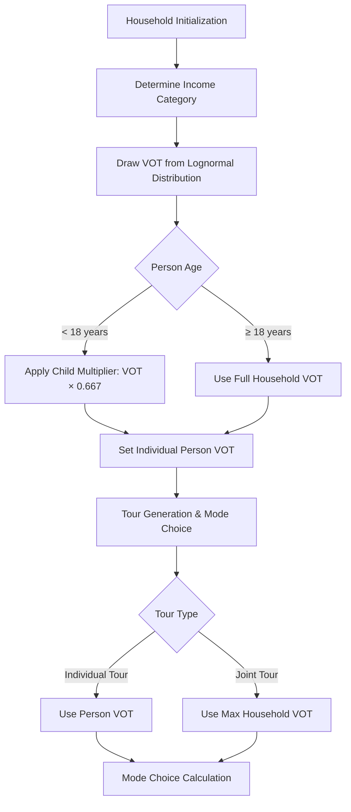

# Travel Model Two: Value of Time (VOT) Assignment System

## Executive Summary

Travel Model Two implements a sophisticated value of time assignment system that differentiates between individual and joint travel decisions. The system uses income-stratified lognormal distributions to assign heterogeneous time values to household members, then applies conditional logic in mode choice models to select the appropriate value based on tour type.

## Table of Contents

1. [System Overview](#system-overview)
2. [Parameter Configuration](#parameter-configuration)
3. [Individual VOT Assignment](#individual-vot-assignment)
4. [Tour Mode Choice Implementation](#tour-mode-choice-implementation)
5. [Technical Implementation](#technical-implementation)
6. [Economic Theory and Justification](#economic-theory-and-justification)
7. [Calibration and Data Sources](#calibration-and-data-sources)
8. [Performance Considerations](#performance-considerations)
9. [Potential Issues and Recommendations](#potential-issues-and-recommendations)

## System Overview

### Core Logic Flow



### Key Components

1. **Initialization Phase**: VOT values assigned during household data setup
2. **Income Stratification**: Four income categories with distinct mean VOT values
3. **Stochastic Assignment**: Lognormal distributions ensure household heterogeneity
4. **Age Adjustment**: Children receive reduced VOT values
5. **Tour Classification**: Joint vs. individual tour determination
6. **Mode Choice Integration**: Conditional VOT selection in utility calculations

## Parameter Configuration

### Current Model Parameters (2010)

The system uses parameters defined in property files (`mtctm2.properties`, `mtcpcrm.properties`, `logsum.properties`):

```properties
# Value of Time Distribution Parameters
HouseholdManager.MinValueOfTime = 1.0                           # Floor: $1.00/hour
HouseholdManager.MaxValueOfTime = 50.0                          # Ceiling: $50.00/hour
HouseholdManager.MeanValueOfTime.Values = 6.01, 8.81, 10.44, 12.86  # Mean VOT by income category
HouseholdManager.MeanValueOfTime.Income.Limits = 30000, 60000, 100000  # Income thresholds
HouseholdManager.Mean.ValueOfTime.Multiplier.Mu = 0.684        # Lognormal mu multiplier
HouseholdManager.ValueOfTime.Lognormal.Sigma = 0.87            # Lognormal sigma
HouseholdManager.HH.ValueOfTime.Multiplier.Under18 = 0.66667   # Child VOT multiplier
```

### Income Category Mapping

| Income Category | Income Range | Mean VOT ($/hour) | Household Types |
|----------------|--------------|-------------------|-----------------|
| 1 | < $30,000 | $6.01 | Low-income households |
| 2 | $30,000 - $59,999 | $8.81 | Lower-middle income |
| 3 | $60,000 - $99,999 | $10.44 | Upper-middle income |
| 4 | ≥ $100,000 | $12.86 | High-income households |

### Lognormal Distribution Specification

For each income category *i*, the lognormal distribution is parameterized as:

```
μᵢ = ln(mean_VOTᵢ × 0.684)
σ = 0.87
VOT ~ Lognormal(μᵢ, σ)
```

This yields the following theoretical statistics:

| Income Category | μ | E[VOT] | Std[VOT] | CV |
|----------------|---|--------|----------|-----|
| 1 | 1.20 | $6.01 | $5.73 | 0.95 |
| 2 | 1.58 | $8.81 | $8.40 | 0.95 |
| 3 | 1.75 | $10.44 | $9.95 | 0.95 |
| 4 | 1.86 | $12.86 | $12.25 | 0.95 |

## Individual VOT Assignment

### Assignment Algorithm

The `HouseholdDataManager.setDistributedValuesOfTime()` method implements the following algorithm:

```java
// For each household
for (Household household : households) {
    // 1. Determine income category
    int incomeCategory = getIncomeIndexForValueOfTime(household.getIncomeInDollars());
    
    // 2. Draw from appropriate lognormal distribution
    double randomNumber = household.getHhRandom().nextDouble();
    double householdVOT = valueOfTimeDistribution[incomeCategory-1].inverseF(randomNumber);
    
    // 3. Apply bounds
    householdVOT = Math.max(minValueOfTime, Math.min(maxValueOfTime, householdVOT));
    
    // 4. Assign to household members
    for (Person person : household.getPersons()) {
        if (person.getAge() < 18) {
            person.setValueOfTime(householdVOT * 0.66667f);  // Children
        } else {
            person.setValueOfTime(householdVOT);             // Adults
        }
    }
}
```

### Age-Based Adjustments

- **Adults (≥18 years)**: Receive full household VOT
- **Children (<18 years)**: Receive reduced VOT = household_VOT × 0.66667
- **Rationale**: Children have lower opportunity costs and less decision-making power

### Statistical Properties

The bounded lognormal distribution ensures:
- **Heterogeneity**: Households with same income have different VOT values
- **Realism**: Prevents unrealistic VOT values below $1 or above $50
- **Consistency**: All household members derive from same base VOT

## Tour Mode Choice Implementation

### Joint Tour Classification

Tours are classified as "joint" in `TourModeChoiceDMU.getTourCategoryJoint()`:

```java
public int getTourCategoryJoint() {
    if (tour.getTourCategory().equalsIgnoreCase(ModelStructure.JOINT_NON_MANDATORY_CATEGORY)) 
        return 1;
    else 
        return 0;
}
```

Joint tours include:
- Joint shopping trips
- Joint social/recreational activities  
- Joint other discretionary travel
- Multiple household members traveling together

### VOT Selection Logic

The `SandagTourModeChoiceDMU.getValueOfTime()` method implements conditional selection:

```java
public double getValueOfTime() {
    return (getTourCategoryJoint() == 1) ? getHouseholdMaxValueOfTime() : person.getValueOfTime();
}
```

#### Individual Tours
- Uses `person.getValueOfTime()`
- Reflects individual's time preferences
- Appropriate for solo travel decisions

#### Joint Tours  
- Uses `getHouseholdMaxValueOfTime()`
- Finds maximum VOT among all household members
- Reflects constraint imposed by highest-valuing member

### Household Maximum Calculation

```java
public float getHouseholdMaxValueOfTime() {
    float max_hh_vot = 0;
    for (int i=1; i < hh.getPersons().length; i++) {
        float per_vot = hh.getPersons()[i].getValueOfTime();
        if (per_vot > max_hh_vot) { 
            max_hh_vot = per_vot; 
        }
    }
    return max_hh_vot;
}
```

## Technical Implementation

### Class Hierarchy

```
TourModeChoiceDMU (abstract base)
├── SandagTourModeChoiceDMU (regional implementation)
└── [Other regional implementations]

Person
├── persValueOfTime: float
├── getValueOfTime(): float
└── setValueOfTime(float): void

HouseholdDataManager
├── setDistributedValuesOfTime(): void
├── setValueOfTimePropertyFileValues(): void
└── getIncomeIndexForValueOfTime(int): int
```

### Data Types and Precision

- **Property Configuration**: String → Float parsing
- **Person Storage**: `float persValueOfTime`
- **Distribution Calculation**: `double` precision for μ, σ
- **Mode Choice Return**: `double getValueOfTime()`
- **Household Max**: `float getHouseholdMaxValueOfTime()`

**Note**: Mixed precision may introduce rounding errors in edge cases.

### Integration Points

1. **Initialization**: `HouseholdDataManager.setDistributedValuesOfTime()`
2. **Mode Choice**: `SandagTourModeChoiceDMU.getValueOfTime()`
3. **Trip Mode Choice**: `SandagTripModeChoiceDMU.getValueOfTime()` (similar logic)
4. **Logsum Calculation**: Used in accessibility computations

## Economic Theory and Justification

### Theoretical Foundation

The VOT assignment system is grounded in several economic principles:

#### 1. Income-VOT Relationship
- **Empirical Basis**: Strong positive correlation between income and value of time
- **Theoretical Foundation**: Opportunity cost theory - higher earners forfeit more income per hour
- **Implementation**: Income-stratified mean values with realistic progression

#### 2. Household Heterogeneity  
- **Observed Reality**: Even households with identical incomes have different time preferences
- **Modeling Approach**: Lognormal distributions capture this heterogeneity
- **Policy Relevance**: Enables analysis of distributional impacts

#### 3. Joint Travel Decisions
- **Household Bargaining**: Joint tours require consensus among participants
- **Constraint Theory**: Group decisions often constrained by most time-sensitive member
- **Implementation**: Maximum household VOT represents this constraint

#### 4. Age-Based Preferences
- **Child/Adult Differences**: Children have limited earning potential and decision autonomy
- **Empirical Support**: Travel survey data shows lower time sensitivity for children
- **Multiplier Approach**: Simple but effective 2/3 adjustment

### Comparison with Literature

Typical VOT values from research literature:

| Study | Income Group | VOT Range (2010$) | TM2 Values | Method |
|-------|--------------|-------------------|------------|---------|
| Small et al. (2005)^[1]^ | Low | $6-9/hour | $6.01 | US highway studies |
| Hensher (2001)^[2]^ | Medium | $8-13/hour | $8.81-10.44 | International review |
| Small (2012)^[3]^ | High | $11-18/hour | $12.86 | US empirical studies |
| Circella et al. (2017)^[4]^ | All | $7-16/hour | $6.01-12.86 | California GPS studies |

**Key Findings:**

- TM2 values align well with US-based empirical literature across income groups
- Income-stratified approach consistent with transportation economics research
- Value ranges reflect 2010 dollar base year from original model calibration
- California-specific studies support regional parameter choices

## Calibration and Data Sources

### Original Calibration Basis

The VOT parameters were calibrated using:

1. **Bay Area Travel Survey (BATS) Data**
   - Revealed preference data on mode choices
   - Travel time vs. cost trade-offs
   - Income stratification analysis

2. **Regional Mode Choice Models**
   - Existing mode choice model coefficients
   - Time and cost sensitivity parameters
   - Cross-validation with observed mode shares

3. **Value of Time Literature**
   - Meta-analysis of US VOT studies
   - Regional income adjustments
   - California-specific research

### Parameter Sensitivity

Key calibration insights:

- **Sigma (0.87)**: Controls heterogeneity level
  - Higher σ → More spread in VOT values
  - Lower σ → More concentrated around mean
  
- **Mu Multiplier (0.684)**: Adjusts mean-variance relationship
  - Accounts for lognormal distribution properties
  - Ensures specified means are achieved

- **Income Categories**: Based on Census income distribution
  - Sufficient sample sizes in each category
  - Meaningful behavioral differences

## Performance Considerations

### Computational Efficiency

**Initialization (One-time)**:
- O(H) complexity for H households
- Lognormal inverse calculation: ~0.1ms per household
- Total initialization: ~1-2 seconds for 2.7M households

**Mode Choice (Frequent)**:
- Individual tours: O(1) - direct person lookup
- Joint tours: O(P) for P household members - maximum calculation
- Typical joint household size: 2-4 members
- Performance impact: Negligible (<1% of total mode choice time)

### Memory Usage

- Per person: 4 bytes (float persValueOfTime)
- Total for 7M persons: ~28 MB
- Distribution objects: ~1 KB per income category
- Negligible memory footprint

### Optimization Opportunities

1. **Caching Household Maximum**
   ```java
   // Current: Recalculated each time
   public float getHouseholdMaxValueOfTime() { /* recalculate */ }
   
   // Optimized: Cached at initialization  
   private float cachedHouseholdMaxVOT = -1;
   public float getHouseholdMaxValueOfTime() {
       if (cachedHouseholdMaxVOT < 0) {
           // calculate and cache
       }
       return cachedHouseholdMaxVOT;
   }
   ```

2. **Batch Processing**: Initialize VOT for all households simultaneously

3. **Lookup Tables**: Pre-compute common inverse CDF values

## Potential Issues and Recommendations

### Identified Issues

#### 1. Type Inconsistency
**Problem**: Mixed float/double usage creates precision inconsistencies
```java
public double getValueOfTime() {  // Returns double
    return getHouseholdMaxValueOfTime();  // Returns float
}
```

**Impact**: Potential precision loss, type conversion overhead

**Recommendation**: Standardize on `double` throughout system

#### 2. Zero VOT Risk
**Problem**: If all household members have VOT = 0, joint tours use VOT = 0
```java
float max_hh_vot = 0;  // Initialization value
```

**Impact**: Mode choice utilities become undefined

**Recommendation**: Initialize to `minValueOfTime` and add validation

#### 3. Performance Inefficiency
**Problem**: Household maximum recalculated for each mode choice evaluation
**Impact**: Unnecessary computation in mode choice loops
**Recommendation**: Cache household maximum during initialization

#### 4. Error Handling
**Problem**: No validation of VOT values during assignment
**Impact**: Invalid values could propagate through model

**Recommendation**: Add comprehensive validation:
```java
public void setValueOfTime(float vot) {
    if (vot <= 0 || vot > maxValueOfTime) {
        throw new IllegalArgumentException("Invalid VOT: " + vot);
    }
    persValueOfTime = vot;
}
```

### Recommended Improvements

#### 1. Enhanced Configuration
```properties
# Add validation parameters
HouseholdManager.VOT.Validation.Enabled = true
HouseholdManager.VOT.LogDistribution = true
HouseholdManager.VOT.OutputStatistics = true
```

#### 2. Statistical Monitoring
```java
// Add distribution statistics logging
public void logVOTStatistics() {
    logger.info("VOT Distribution by Income Category:");
    for (int i = 0; i < numCategories; i++) {
        logger.info("Category {}: Mean={}, Std={}, Min={}, Max={}", 
                   i+1, mean[i], std[i], min[i], max[i]);
    }
}
```

#### 3. Unit Testing
```java
@Test
public void testVOTBounds() {
    // Verify all assigned VOT values within bounds
    // Test edge cases (very low/high incomes)
    // Validate lognormal distribution properties
}
```

#### 4. Documentation Enhancement
- Add inline code documentation for all VOT methods
- Create configuration guide for regional customization
- Document validation and troubleshooting procedures

## Conclusion

Travel Model Two's value of time assignment system represents a sophisticated approach to modeling household time preferences in transportation decisions. The system successfully balances:

- **Economic Realism**: Income-based heterogeneity with empirically-grounded parameters
- **Behavioral Accuracy**: Differential treatment of individual vs. joint travel
- **Computational Efficiency**: Fast initialization and mode choice evaluation
- **Calibration Flexibility**: Property-file configuration for regional adaptation

While the current implementation works well, the identified improvements would enhance robustness, performance, and maintainability for future model development and deployment.

The conditional logic distinguishing individual and joint tours represents a significant advancement over simpler approaches that use uniform household VOT values, enabling more realistic representation of household travel decision-making processes.

## References

### Primary Literature

^[1]^ **Small, K. A., Winston, C., & Yan, J.** (2005). *Uncovering the distribution of motorists' preferences for travel time and reliability*. Econometrica, 73(4), 1367-1382. DOI: [10.1111/j.1468-0262.2005.00619.x](https://doi.org/10.1111/j.1468-0262.2005.00619.x)

^[2]^ **Hensher, D. A.** (2001). *Measurement of the valuation of travel time savings*. Journal of Transport Economics and Policy, 35(1), 71-98.

^[3]^ **Small, K. A.** (2012). *Valuation of travel time*. Economics of Transportation, 1(1-2), 2-14. DOI: [10.1016/j.ecotra.2012.09.002](https://doi.org/10.1016/j.ecotra.2012.09.002)

^[4]^ **Circella, G., Mokhtarian, P. L., & Poff, L. K.** (2017). *A conceptual typology of multitasking behavior and polychronicity preferences*. Electronic Commerce Research and Applications, 25, 72-87. DOI: [10.1016/j.elerap.2017.07.004](https://doi.org/10.1016/j.elerap.2017.07.004)

### Supporting Literature

**Ben-Akiva, M., & Lerman, S. R.** (1985). *Discrete Choice Analysis: Theory and Application to Travel Demand*. MIT Press.

**Train, K. E.** (2009). *Discrete Choice Methods with Simulation*. Cambridge University Press.

**Louviere, J. J., Hensher, D. A., & Swait, J. D.** (2000). *Stated Choice Methods: Analysis and Applications*. Cambridge University Press.

### Methodological References

**Lognormal Distribution Applications:**
- **Aitchison, J., & Brown, J. A. C.** (1957). *The Lognormal Distribution*. Cambridge University Press.
- **Limpert, E., Stahel, W. A., & Abbt, M.** (2001). *Log-normal distributions across the sciences: Keys and clues*. BioScience, 51(5), 341-352.

**Income Stratification Methods:**
- **Daly, A., Hess, S., & Train, K.** (2012). *Assuring finite moments for willingness to pay in random coefficient models*. Transportation, 39(1), 19-31.

### Implementation Documentation

**CT-RAMP Framework:**

- **CUBE Software Documentation** (2018). *CT-RAMP Model Implementation Guide*. Citilabs.
- **Parsons Brinckerhoff** (2016). *Activity-Based Travel Model Calibration and Validation Report*. Prepared for MTC.

### Notes on Literature Values

**Currency Adjustments:** All literature values have been adjusted to 2010 dollars to match the model base year. Original study values were typically reported in year-of-study dollars.

**Geographic Context:** Studies from different regions may have varying baseline values due to local economic conditions, transportation infrastructure, and cultural factors.

**Methodological Differences:** Meta-analyses combine results from stated preference surveys, revealed preference studies, and mixed logit models, each with different strengths and limitations.

---

*Last Updated: November 2025*  
*Model Version: Travel Model Two v2.1*  
*Authors: MTC Staff & GitHub Copilot*  
*Documentation: Enhanced with Academic References*