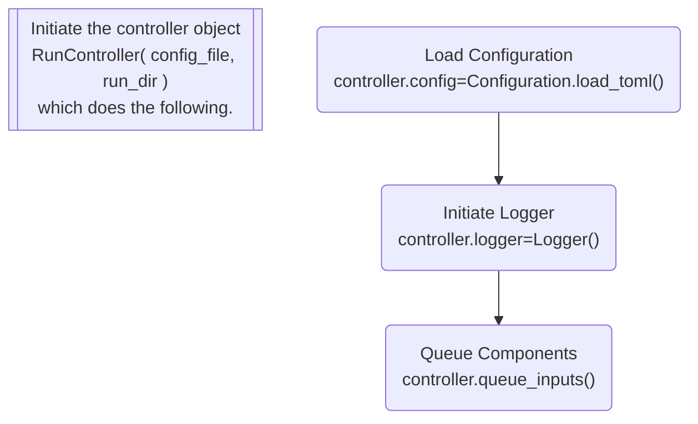
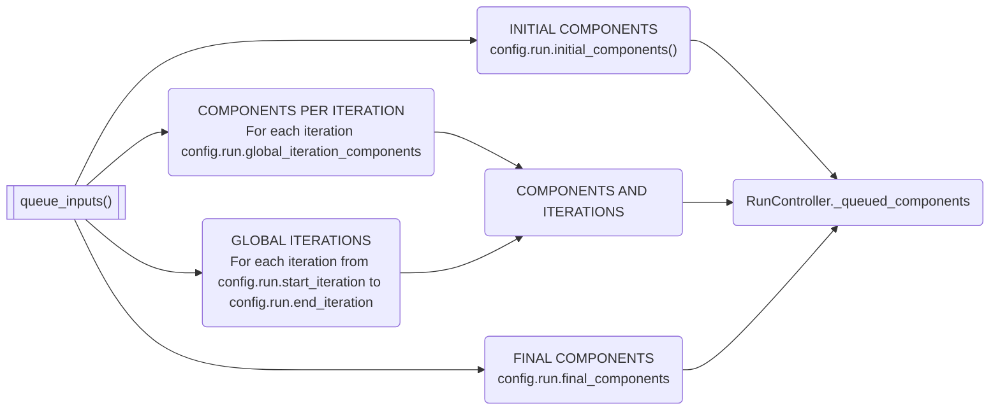

## What happens when you run the model

Setup of model run reads the settings and queues the components for each iteration.

```python
my_controller = tm2py.RunController(config_files,run_dir)
```



`RunController.queue_inputs()`



Example model run configuraiton file with components in the order they are to be run:

```toml
[run]
    start_component = ""
    initial_components = [
        "create_tod_scenarios", 
        "active_modes", 
        "air_passenger", 
        "prepare_network_highway", 
        "highway", 
        "highway_maz_skim", 
        "prepare_network_transit",
        "transit_assign",
        "transit_skim"
    ]
    global_iteration_components = [
        "household", 
        "internal_external", 
        "truck", 
        "highway_maz_assign", 
        "highway", 
        "prepare_network_transit",
        "transit_assign",
        "transit_skim"
    ]
    final_components = []
    start_iteration = 0
    end_iteration = 1

```

Running the model simply iterates through the queued components.

```python
my_run = my_controller.run()
```

```mermaid
flowchart TD
    controller_run[["controller.run()"]]
    validate_inputs("controller.validate_inputs()")
    component_run[["For each item in controller._queued_components\ncomponent.run()"]]
    
    validate_inputs-->component_run
